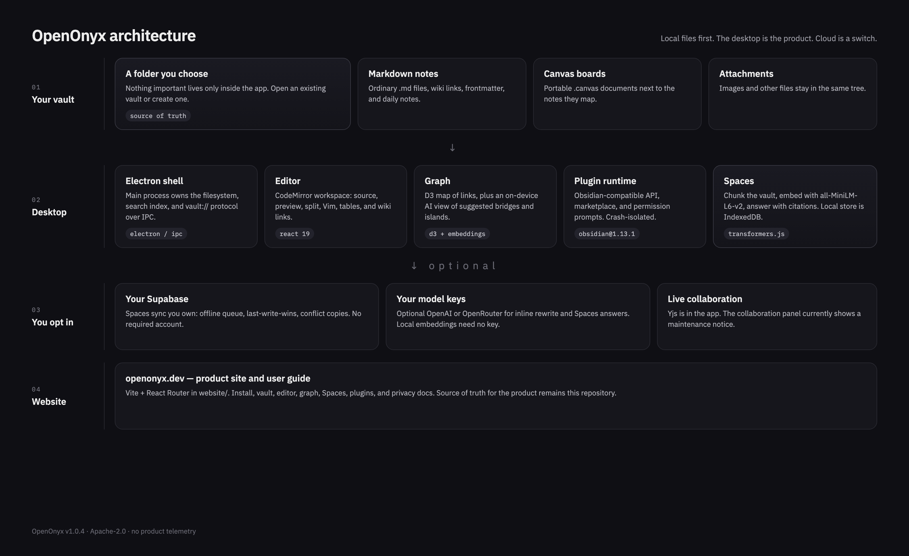

<p align="center">
  
</p>

## Local-first knowledge workspace for notes you keep as files

[](LICENSE)
[](https://github.com/OpenOnyx/OpenOnyx/releases)
[](https://github.com/OpenOnyx/OpenOnyx/actions/workflows/ci.yml)
[](package.json)

**OpenOnyx** is an Apache-2.0 desktop app. You point it at a folder — a vault — and write Markdown there. The editor, graph, search, Spaces, and plugins all read those files. Nothing important lives only inside the app. You do not need an account.

It is the right tool if you want notes that remain ordinary files, a graph and a local thinking layer without assembling a plugin shopping list, and cloud only when you bring your own project. It is not a hosted-only notes service, and there is no shipped phone client yet.

Current release is **v1.0.4**. There is no product telemetry.

The desktop adds:

- A CodeMirror workspace — source, preview, split, wiki links, Vim, tables
- A D3 knowledge graph, plus an on-device AI view of suggested links and islands
- Portable `.canvas` boards next to the notes they map
- **Spaces** — chunk the vault, embed with `all-MiniLM-L6-v2`, answer with citations
- An [Obsidian-compatible](docs/obsidian-plugin-compatibility.md) plugin runtime (`obsidian@1.13.1`, 158/158 public exports)
- Optional Spaces sync on **your** Supabase. Live multiplayer is in the app but currently under maintenance

## Architecture

OpenOnyx is a local-first desktop with an optional cloud switch. The vault on disk is the source of truth. The Electron main process owns the filesystem and search index. The React renderer is the workspace. Spaces embeddings stay on device unless you opt a Space into your own backend.

<p align="center">
  
</p>

| Layer | What it is | Where it lives |
| --- | --- | --- |
| Vault | `.md`, `.canvas`, attachments | A folder you choose |
| Desktop | Electron 41, React 19, CodeMirror, D3, plugin runtime | [`electron/`](electron/), [`src/`](src/) |
| Spaces | Local RAG (`Transformers.js` + IndexedDB) | [`src/utils/spaces-rag.ts`](src/utils/spaces-rag.ts), [`docs/spaces.md`](docs/spaces.md) |
| Optional cloud | Your Supabase, your OpenAI / OpenRouter keys | [`supabase/`](supabase/), [`.env.example`](.env.example) |
| Website | Product site and user guide | [`website/`](website/) |

Collaboration (Yjs) is implemented in-tree. The collaboration panel currently shows a maintenance notice — do not treat live multiplayer as ready.

## To start using OpenOnyx

Download a build from [Releases](https://github.com/OpenOnyx/OpenOnyx/releases), or use the site at [openonyx.dev](https://openonyx.dev) (placeholder — swap this URL when the public site is live).

| Platform | Artifact |
| --- | --- |
| macOS | `.dmg` / `.zip`. If Gatekeeper blocks the app: right-click → Open, or `xattr -cr /Applications/OpenOnyx.app` |
| Windows | `.exe`. Signing by [SignPath.io](https://signpath.io/) / [SignPath Foundation](https://signpath.org/) |
| Linux | `.AppImage`, `.deb`, or Arch `.pkg.tar.zst` |

Linux installer:

```bash
curl -fsSL https://raw.githubusercontent.com/OpenOnyx/OpenOnyx/main/scripts/install.sh | bash
```

Open a folder. That folder is the vault.

## To start developing OpenOnyx

You need [Node.js](https://nodejs.org/) 22 or newer and npm 9+.

```bash
git clone https://github.com/OpenOnyx/OpenOnyx.git
cd OpenOnyx
npm install
npm run dev
```

That builds the Electron main process, starts Vite at `http://localhost:5173`, and launches the desktop app.

If Electron’s postinstall download was skipped:

```bash
npm config set ignore-scripts false
npm rebuild electron
npm run dev
```

| Command | Purpose |
| --- | --- |
| `npm run dev` | Desktop app + Vite |
| `npm run lint` | Typecheck (`tsc --noEmit`) |
| `npm run test` | Unit tests |
| `npm run test:plugin-runtime` | Plugin API runtime tests |
| `npm run test:all-checks` | Full contributor gate |
| `npm run package` | Local installers in `release/` |

Platform packages: `npm run package:mac`, `package:win`, `package:linux`. Tagged GitHub releases are built by [`.github/workflows/release.yml`](.github/workflows/release.yml). Distro templates are in [`packaging/`](packaging/).

Optional Spaces sync uses [`.env.example`](.env.example) → `.env.local` (`VITE_SUPABASE_URL`, `VITE_SUPABASE_ANON_KEY`) and [`supabase/schema.sql`](supabase/schema.sql). Local vaults, search, graph, and local Spaces need no environment variables.

The website is a separate Vite app:

```bash
cd website
npm install
npm run dev
```

## Website

User-facing docs and the product tour live at [openonyx.dev](https://openonyx.dev) (placeholder URL). Source is [`website/`](website/). Contributor technical notes stay in [`docs/`](docs/README.md).

## Contributing

We love our contributors. If you want to help, start with [CONTRIBUTING.md](CONTRIBUTING.md). Fork, branch from `main`, keep the change small, run `npm run lint` and the tests that match what you touched, then open a pull request against `OpenOnyx/OpenOnyx`.

This community has a [Code of Conduct](CODE_OF_CONDUCT.md). Please follow it.

Good first issues are labeled [`good first issue`](https://github.com/OpenOnyx/OpenOnyx/issues?q=is%3Aissue+is%3Aopen+label%3A%22good+first+issue%22).

## Our Roadmap

What is shipped, what is next, and what is later: [docs/roadmap.md](docs/roadmap.md). The living backlog is [GitHub Issues](https://github.com/OpenOnyx/OpenOnyx/issues).

## Getting in touch

- [GitHub Issues](https://github.com/OpenOnyx/OpenOnyx/issues) — bugs and feature work
- [GitHub Discussions](https://github.com/OpenOnyx/OpenOnyx/discussions) — questions and ideas
- [openonyx@gmail.com](mailto:openonyx@gmail.com) — project contact
- Security reports: [SECURITY.md](SECURITY.md) (not the public tracker)

<div align="center">

<h2>
  
  Contributors
</h2>

<a href="https://github.com/OpenOnyx/OpenOnyx/graphs/contributors">
  
</a>

</div>

## Support

- Bugs and features: [GitHub Issues](https://github.com/OpenOnyx/OpenOnyx/issues)
- Security: [SECURITY.md](SECURITY.md)

## License

[Apache License 2.0](LICENSE).
