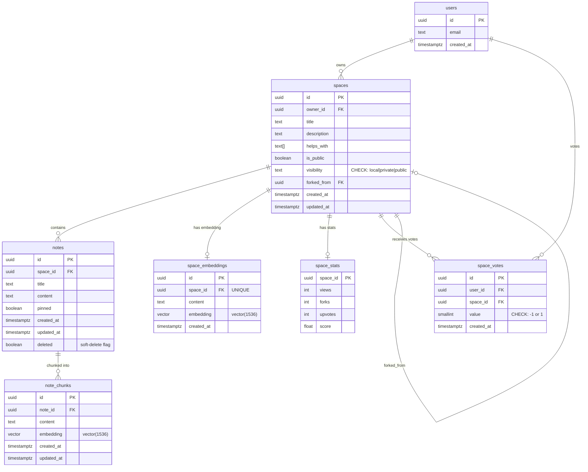
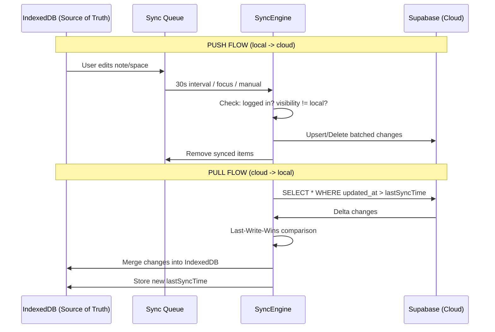
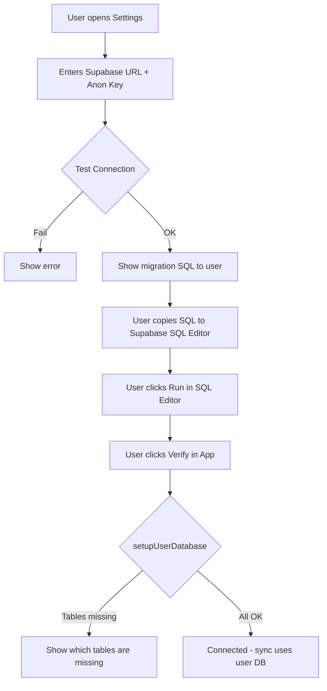
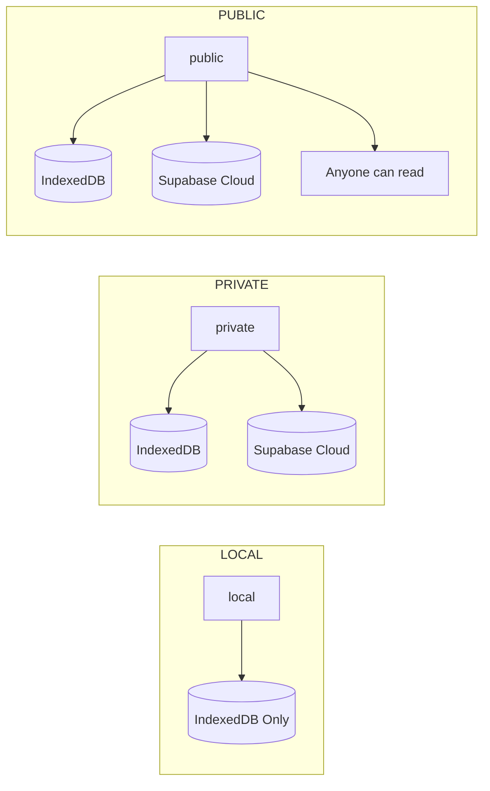

# OpenObsidian -- Database & Sync Architecture

## System Overview

This document describes the complete database, sync, and publishing architecture for OpenObsidian. The system is **local-first** with optional cloud sync via Supabase, supporting spaces with three visibility levels, public sharing, and user-owned database instances.

---

## 1. SQL Schema (Applied to Supabase)

Three migrations were applied to the live `lnesemdbowelyzzxeayl` project:

| Migration | Purpose |
|-----------|---------|
| `consolidate_schema_v2` | Added `created_at`/`deleted` to notes, `updated_at` to note_chunks, visibility constraint, sync indexes, auto-update triggers |
| `fix_rls_policies_v2` | Corrected all RLS policies to use `visibility` column instead of `is_public`, added users INSERT policy, added auth trigger |
| `lock_down_security_definer_functions` | Revoked anon/authenticated EXECUTE on internal trigger functions |

### Final Table Structure



### Key Schema Decisions

- **`visibility` column** replaces the old `is_public` boolean as the primary access control field. Constrained to `'local' | 'private' | 'public'`. `is_public` is kept for backward compatibility but `visibility` is the source of truth.
- **Soft-delete on notes**: `deleted boolean DEFAULT false`. Notes are never physically removed during sync -- they are marked deleted. This prevents data loss during sync conflicts and enables future undo/recovery.
- **`updated_at` on all synced tables**: Enables delta-sync queries (`WHERE updated_at > lastSyncTime`). Auto-updated via database triggers.
- **Indexes**: Compound indexes on `(owner_id, updated_at)`, `(space_id, updated_at)`, and `(note_id, updated_at)` optimize sync pull queries.

---

## 2. RLS Policies (All Applied)

### Access Matrix

| Table | SELECT | INSERT | UPDATE | DELETE |
|-------|--------|--------|--------|--------|
| **users** | Own profile only | Own profile only | Own profile only | -- |
| **spaces** | Own OR `visibility='public'` | Own only (`owner_id = auth.uid()`) | Own only | Own only |
| **notes** | Via space access (own OR public) | Via space ownership | Via space ownership | Via space ownership |
| **note_chunks** | Via note -> space access | Via note -> space ownership | Via note -> space ownership | Via note -> space ownership |
| **space_embeddings** | Via space access | Via space ownership | Via space ownership | Via space ownership |
| **space_stats** | Everyone (public) | -- (managed by RPC) | -- (managed by RPC) | -- |
| **space_votes** | Everyone | Own votes only | Own votes only | Own votes only |

### Security Hardening

Internal SECURITY DEFINER functions that are only meant to be called by triggers (not via the REST API) have had `EXECUTE` revoked from both `anon` and `authenticated` roles:

- `handle_new_user()` -- auth trigger only
- `set_updated_at()` -- update trigger only
- `rls_auto_enable()` -- internal utility
- `increment_space_forks()` -- revoked from anon (requires auth)
- `vote_on_space()` -- revoked from anon (requires auth)

---

## 3. Sync Flow (Step-by-Step)

### Architecture Diagram



### PUSH (Local -> Cloud)

1. User modifies a space/note/chunk locally
2. `localDB.putSpace()` / `putNote()` / `putChunk()` writes to IndexedDB
3. If `visibility !== 'local'` and user is logged in, a `SyncQueueItem` is enqueued
4. SyncEngine picks up the queue on next cycle
5. For each item:
   - Skip if parent space is `visibility === 'local'`
   - `upsert` action: `client.from(table).upsert(payload)`
   - `delete` action: soft-delete for notes (`update({deleted: true})`), hard-delete for spaces/chunks
6. On success, remove from sync queue
7. On failure, leave in queue for retry

### PULL (Cloud -> Local)

1. SyncEngine reads `lastSyncTime` from IndexedDB metadata
2. Queries Supabase: `spaces WHERE owner_id = user.id AND updated_at >= lastSyncTime`
3. For each remote space, compares `updated_at` with local copy:
   - Remote newer or local missing -> overwrite local
   - Local newer -> keep local (it will be pushed on next cycle)
4. Queries notes for all synced space IDs with same delta logic
5. Handles soft-deletes: if remote note has `deleted = true`, removes from local
6. Queries chunks for synced notes
7. Updates `lastSyncTime`

### Conflict Strategy: Last-Write-Wins

```
if (remote.updated_at >= local.updated_at) {
  // Remote wins -- overwrite local
} else {
  // Local wins -- keep local, will push on next cycle
}
```

> [!NOTE]
> This is deliberately simple. CRDT-based conflict resolution is planned for the future real-time collaboration feature but is not needed today.

### Sync Triggers

| Trigger | Interval | Description |
|---------|----------|-------------|
| Auto-sync | 30 seconds | `setInterval` in SyncEngine constructor |
| Focus sync | On window focus | `window.addEventListener('focus', ...)` |
| Manual sync | User-triggered | Call `syncEngine.sync()` directly |
| Publish sync | On publish | `syncEngine.pushSpace(spaceId)` force-pushes all data |
| Full sync | On login/new device | `syncEngine.fullSync()` pulls everything |

---

## 4. setupUserDatabase Implementation

### Strategy

Users can connect their own Supabase instance. The architecture:

1. User provides their Supabase **project URL** and **anon key**
2. App tests connectivity via `testConnection()`
3. User runs the migration SQL (`supabase/schema.sql`) in their Supabase SQL Editor
4. App calls `setupUserDatabase()` which verifies all tables exist
5. The `SyncEngine` transparently switches to the user's client via `getActiveClient()`

### Why SQL Editor?

The Supabase anon key cannot execute DDL (CREATE TABLE, ALTER TABLE, etc.) -- this is by design for security. Therefore, schema installation must be done through the SQL Editor in the Supabase dashboard, which runs with service-role privileges.

### Implementation

The complete implementation is in [userDatabase.ts](file:///home/varshith/VOLT/notework/src/lib/userDatabase.ts):

- `connectUserDatabase(config)` -- creates and caches a typed Supabase client
- `testConnection(config)` -- validates URL/key pair
- `setupUserDatabase(config)` -- verifies schema installation
- `getMigrationSQL()` -- returns the complete SQL for the user to copy
- `isUserDatabaseConfigured()` -- checks if a user DB is active

The standalone migration SQL is at [schema.sql](file:///home/varshith/VOLT/notework/supabase/schema.sql).

### Flow



---

## 5. API Functions (TypeScript)

### Spaces API -- [spaces.ts](file:///home/varshith/VOLT/notework/src/lib/spaces.ts)

```typescript
// Create a new space (defaults to 'local')
createSpace({ title, description?, helpsWith?, visibility? }): Promise<Space>

// Change visibility to 'public', push all notes to cloud
publishSpace(spaceId: string): Promise<Space>

// Change visibility to 'private' (still synced)
unpublishSpace(spaceId: string): Promise<Space>

// Change visibility to 'private' (with auth required)
makeSpacePrivate(spaceId: string): Promise<Space>

// Remove from cloud entirely, set to 'local'
makeSpaceLocal(spaceId: string): Promise<Space>

// Clone a public space under current user
forkSpace(originalSpaceId: string): Promise<string>
```

### Sync API -- [syncEngine.ts](file:///home/varshith/VOLT/notework/src/lib/syncEngine.ts)

```typescript
// Incremental sync (push queue + pull delta)
syncEngine.sync(): Promise<{ pushed: number; pulled: number }>

// Full rebuild from cloud (new device login)
syncEngine.fullSync(): Promise<number>

// Force-push a space and all its contents
syncEngine.pushSpace(spaceId: string): Promise<void>

// Promote all local spaces to private cloud
syncEngine.promoteLocalSpacesToCloud(): Promise<number>

// Subscribe to sync status changes
syncEngine.onStatusChange(listener): () => void
```

### User Database API -- [userDatabase.ts](file:///home/varshith/VOLT/notework/src/lib/userDatabase.ts)

```typescript
// Test if URL/key pair is valid
testConnection(config): Promise<{ ok: boolean; error?: string }>

// Connect to user's Supabase instance
connectUserDatabase(config): SupabaseClient

// Verify schema is installed
setupUserDatabase(config): Promise<SetupResult>

// Get the migration SQL for manual installation
getMigrationSQL(): string

// Check if user DB is active
isUserDatabaseConfigured(): boolean
```

### Local DB API -- [localdb.ts](file:///home/varshith/VOLT/notework/src/lib/localdb.ts)

```typescript
// Spaces CRUD
localDB.getSpaces(): Promise<LocalSpace[]>
localDB.getSpace(id): Promise<LocalSpace | undefined>
localDB.putSpace(space, enqueueSync?): Promise<void>
localDB.deleteSpace(id, enqueueSync?): Promise<void>

// Notes CRUD
localDB.getNotes(spaceId): Promise<LocalNote[]>
localDB.getNote(id): Promise<LocalNote | undefined>
localDB.putNote(note, enqueueSync?): Promise<void>
localDB.deleteNote(id, enqueueSync?): Promise<void>

// Chunks CRUD
localDB.getChunks(noteId): Promise<LocalNoteChunk[]>
localDB.putChunk(chunk, enqueueSync?): Promise<void>

// Sync State
localDB.getSyncQueue(): Promise<SyncQueueItem[]>
localDB.getLastSyncTime(): Promise<string | undefined>
localDB.setLastSyncTime(time): Promise<void>
```

---

## 6. Visibility Logic



| Visibility | IndexedDB | Cloud Sync | Public Read | Auth Required |
|-----------|-----------|------------|-------------|---------------|
| `local` | Yes | No | No | No |
| `private` | Yes | Yes | No | Yes |
| `public` | Yes | Yes | Yes | Yes (to create) |

---

## 7. Embeddings & Indexing

### Pipeline

1. Note is created/updated
2. `debouncedIndexNote()` waits 2s after last keystroke
3. `chunkText()` splits content into ~300-500 word chunks respecting paragraph boundaries
4. Each chunk is sent to the `embed` edge function (OpenAI-compatible API)
5. Chunks are stored locally in IndexedDB
6. SyncEngine pushes chunks to Supabase (if space is synced)
7. Vector search via `match_note_chunks` RPC function uses cosine similarity

### Chunk Strategy

- Target: 300-500 words per chunk
- Respects paragraph boundaries (`\n\n`)
- Oversized chunks are split by word count
- Minimum content threshold: 20 characters

---

## 8. Files Changed

| File | Action | Description |
|------|--------|-------------|
| [database.types.ts](file:///home/varshith/VOLT/notework/src/lib/database.types.ts) | Updated | Regenerated from Supabase to reflect new columns |
| [localdb.ts](file:///home/varshith/VOLT/notework/src/lib/localdb.ts) | Updated | Added `created_at`/`deleted` to LocalNote, `updated_at` to LocalNoteChunk |
| [syncEngine.ts](file:///home/varshith/VOLT/notework/src/lib/syncEngine.ts) | Rewritten | LWW conflict resolution, soft-delete, user-DB switching, status listeners, pushSpace |
| [userDatabase.ts](file:///home/varshith/VOLT/notework/src/lib/userDatabase.ts) | **New** | User-owned Supabase setup, connection management, migration SQL |
| [schema.sql](file:///home/varshith/VOLT/notework/supabase/schema.sql) | **New** | Standalone idempotent migration for user-owned databases |

### Database Migrations Applied

| Migration | Status |
|-----------|--------|
| `consolidate_schema_v2` | Applied |
| `fix_rls_policies_v2` | Applied |
| `lock_down_security_definer_functions` | Applied |

---

## 9. What Was NOT Implemented (By Design)

| Feature | Reason |
|---------|--------|
| Real-time collaboration | Premature -- requires CRDT or OT, not needed yet |
| Complex permissions / ACL | No `access_control` table -- spaces are owner-only for now |
| Organizations / workspaces | Out of scope -- users have personal spaces only |
| CRDT conflict resolution | LWW is sufficient for single-user sync; CRDT adds significant complexity |
| Automatic DDL via anon key | Not possible by Supabase security design; SQL Editor is the correct path |

---

## 10. Future Extension Points

- **Real-time collaboration**: Add Supabase Realtime subscriptions on `notes` table, implement operational transform or CRDT
- **Shared spaces**: Add `space_members` table with role-based access, extend RLS policies
- **Organizations**: Add `organizations` and `org_members` tables, scope spaces to orgs
- **Offline queue persistence**: The sync queue already persists in IndexedDB, enabling offline-first with queue replay
- **Conflict UI**: Surface LWW conflicts to users with a diff view instead of silent overwrite
